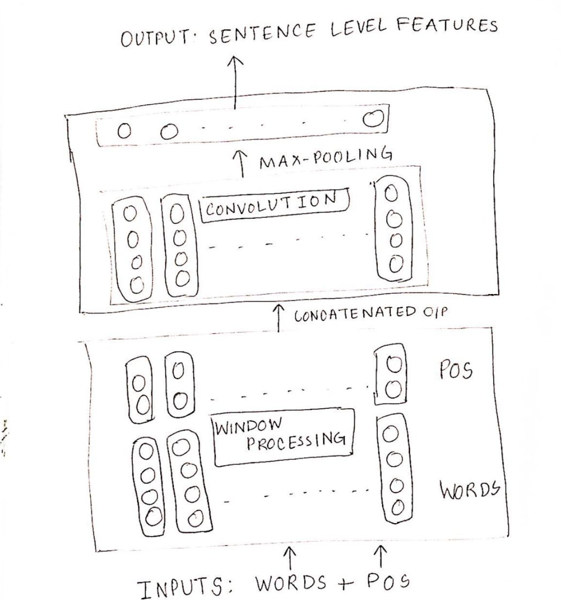

# Relation_Classification_NLP
Given 10 predefined relations like cause-effect, product-producer, etc, the goal is to define the relation and the direction of the relation between 2 entities in a sentence. The implemtation consists of a basic BiGRU model and a CNN model with outperforms the basic model.

The CNN model has been used as even after adding POS and dependency features the CNN model outperforms the biGRU model (basic model).The convolution layer is defined using keras layer implementation of Conv1D and max-pool using keras layer implementation of GlobalMaxPool1D. Define decoder using its keras layer implementation. In the call function, first the window processing is done using embedding_lookup for word and pos embeddings. Then we concatenate word and pos embeddings and then apply convolution on the concatenated output. Then max-pooling is done by calling the previously defined max_pool layer. At last, we extract sentence level features using the previously defined decoder.

The CNN model has been implemented with one convolutional layer. The architecture details are described in below Figure.

## Observations (CNN Model):

    Regularization lambda value when set to (10)^(-4):
     - Val loss for last epoch (09): 2.0366
     - Val F1 score: 0.5981
    Training the model for word embeddings and dependency features:
     - Val loss for epoch: 2.0204
     - Val F1 score: 0.6044
    Training the model for word embeddings and POS features:
     - Val loss for epoch: 2.323
     - Val F1 score: 0.5065
    The prediction files for each have been uploaded.
